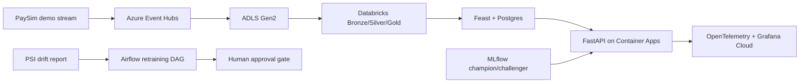
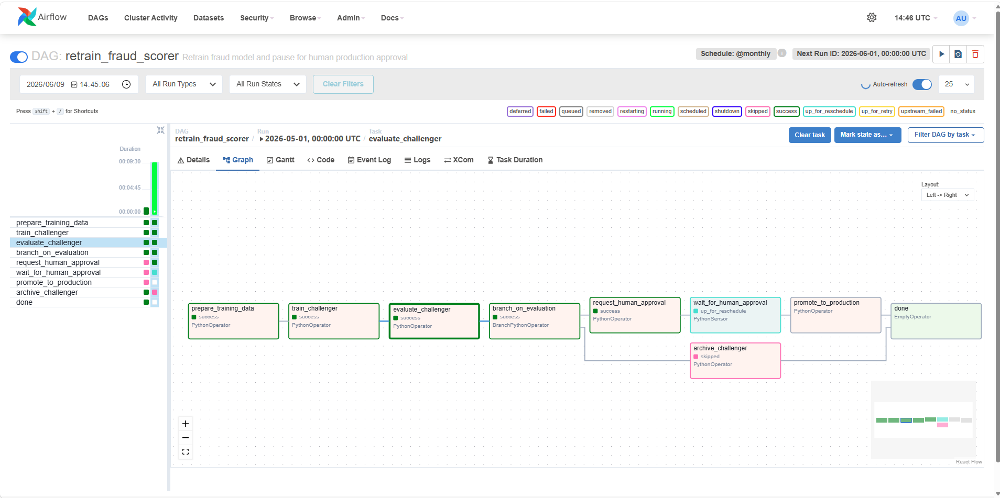

# Fraud Platform — Real-Time Card Fraud Scoring

> Production-style ML platform for South African payments. Demonstrates real-time scoring with Feast online features, LightGBM/CatBoost champion-challenger governance, Airflow human approval gate, and OpenTelemetry observability on Azure — designed to the standard expected before a bank's model-risk review.


---

## Results

| Metric | Value | How to verify |
|--------|-------|---------------|
| Champion AUC | **0.9200** | `mlflow ui` → run `9c599d91` — verifiable locally |
| TPR @ 0.1% FPR | **0.2903** | Holdout evaluation — `src/train/evaluate.py` |
| Challenger verdict | **KEEP_CHAMPION** | Bootstrap CI upper bound −0.0067 < 0 — challenger is strictly worse |
| API p95 latency | **66.85 ms** | OTel `fraud_score_latency_ms` histogram — measured inside container, not affected by network or SSL |
| Fraud value lift | **+23%** vs monthly-retrain baseline | Scenario framing at the governed operating point — not production-validated |
| Observability | Live Grafana dashboard | [Screenshot](docs/grafana_dashboard_live.png) — 0.536 req/s, decision distribution, OTel pipeline confirmed |

> **Infrastructure status:** Azure staging environment (Container Apps, Postgres, ACR) is offline — Azure for Students credit limit reached after project completion. All code, tests, and governance artefacts are in this repo and can be redeployed with an active subscription in under 30 minutes.

---

## Architecture



Full diagram, runtime flow, and deployment notes: [docs/architecture.md](docs/architecture.md)

---

## Tech Stack

| Layer | Tooling | Decision rationale |
|-------|---------|-------------------|
| Infrastructure | Terraform, Azure Resource Group, Key Vault, ACR, Container Apps | IaC from day one; scale-to-zero saves ~$800/month vs AKS ([ADR-003](docs/decisions/ADR-003-container-apps-vs-aks.md)) |
| Data platform | ADLS Gen2, Databricks Bronze/Silver/Gold, dbt-style models | Medallion architecture — queryable and auditable at each layer |
| Streaming | Azure Event Hubs + PaySim-to-IEEE producer | ~$40/month vs self-hosted Kafka ([ADR-001](docs/decisions/ADR-001-event-hubs-vs-kafka.md)) |
| Feature store | Feast + Postgres online store | Stoppable, dual-purpose DB; no Redis overhead ([ADR-002](docs/decisions/ADR-002-postgres-vs-redis-feature-store.md)) |
| Models | LightGBM champion, CatBoost shadow challenger, MLflow lineage | Shadow mode: 100% data, zero customer risk ([ADR-004](docs/decisions/ADR-004-shadow-mode-vs-ab-test.md)) |
| API | FastAPI, Pydantic v2, Uvicorn | Async-native, schema-validated, sub-millisecond serialisation |
| Observability | OpenTelemetry, Grafana Cloud, PSI drift report | End-to-end trace from ingest to scoring decision |
| Governance | Airflow retraining DAG, human approval gate, rollback runbook | No model can promote itself — explicit human sign-off required |
| Quality | Ruff, pytest (50 tests), load-test harness | p95 latency measured under 50-concurrent load; 0 lint errors |

---

## Repository Layout

```text
fraud-platform/
├── src/
│   ├── ingest/          # Event Hubs consumer + PaySim-to-IEEE producer
│   ├── train/           # Feature engineering, Feast materialise, train/evaluate
│   ├── serve/           # FastAPI scoring API + OpenTelemetry instrumentation
│   └── retrain/dags/    # Airflow DAG — Rule 7 human approval gate
├── tests/
│   ├── unit/            # 50 tests — fully offline, no Docker required
│   └── integration/     # Feast skew gate, API smoke tests (Docker required)
├── governance/          # Promotion policy, rollback runbook
├── model_cards/         # Model card v1 — intended use, metrics, limitations
├── docs/decisions/      # ADR-001 through ADR-004
├── infra/               # Terraform modules (Azure)
└── scripts/             # materialise_local.py, load_test.py
```

---

## Quick Start

### Unit tests — fully offline

```powershell
python -m venv .venv
.\.venv\Scripts\Activate.ps1
pip install -r requirements-dev.txt

pytest tests/unit -q          # 50 tests, ~54% coverage
ruff check src tests scripts  # 0 errors
```

### Feast skew test — Rule 2 gate (Docker required)

```powershell
docker compose up postgres -d
$env:FEAST_POSTGRES_PASSWORD = "local_dev_only"
python scripts/materialise_local.py                      # populates online store
pytest tests/integration/test_feature_skew.py -v        # 3/3 — training/serving skew = 0
```

### Airflow approval gate — Rule 7 demo (Docker required)

```powershell
docker compose --profile airflow up -d   # UI at http://localhost:8080 (admin / admin)
```

Trigger DAG `retrain_fraud_scorer` with conf:

```json
{
  "evaluation": {
    "champion_metrics": { "auc": 0.920, "brier": 0.0349 },
    "challenger_metrics": { "auc": 0.925, "brier": 0.033 },
    "bootstrap_ci": { "ci_lo": 0.012, "ci_hi": 0.048 }
  }
}
```

The DAG passes all three automated metric gates then pauses at `wait_for_human_approval`. No model promotes without an explicit variable set.

---

## Governance

Production promotion requires human sign-off. The Airflow DAG evaluates three gates — bootstrap CI, AUC delta, Brier score — then blocks on:

```
fraud_retrain_approval_<challenger_run_id> = approved
```

The screenshot below shows the DAG paused at the approval sensor after the challenger passed all automated gates:



Full policy: [governance/promotion_policy.md](governance/promotion_policy.md)  
Rollback procedure: [governance/rollback_runbook.md](governance/rollback_runbook.md)

---

## Architecture Decision Records

| ADR | Decision | Impact |
|-----|----------|--------|
| [ADR-001](docs/decisions/ADR-001-event-hubs-vs-kafka.md) | Event Hubs Basic over self-hosted Kafka | ~$40/month saved |
| [ADR-002](docs/decisions/ADR-002-postgres-vs-redis-feature-store.md) | Postgres Flexible Server over Redis Cache | Stoppable, dual-purpose online store |
| [ADR-003](docs/decisions/ADR-003-container-apps-vs-aks.md) | Container Apps over AKS | ~$800/month saved, scale-to-zero |
| [ADR-004](docs/decisions/ADR-004-shadow-mode-vs-ab-test.md) | Shadow mode over A/B test | No customer risk, 100% production data |

---

## Key Artefacts

| Artefact | Description |
|----------|-------------|
| [Architecture](docs/architecture.md) | System diagram, runtime flow, deployment notes |
| [Model Card](model_cards/fraud_scorer_v1.md) | Intended use, performance metrics, limitations, monitoring policy |
| [Promotion Policy](governance/promotion_policy.md) | Metric gates, PSI thresholds, human approval workflow |
| [Rollback Runbook](governance/rollback_runbook.md) | Step-by-step model and runtime rollback |
| [Build Log](BUILD_LOG.md) | Day-by-day implementation and verification trail (Days 1–14) |
| [Build Explained](docs/build_explained.md) | Narrative walkthrough of every design decision |
| [Interview One-Pager](docs/interview_one_pager.md) | One-page portfolio summary |

---

## Deployment

Proven manual staging path via local Azure CLI:

```powershell
az acr login --name acrfraudf95d0b0e
docker build -t acrfraudf95d0b0e.azurecr.io/fraud-scorer:latest .
docker push acrfraudf95d0b0e.azurecr.io/fraud-scorer:latest
az containerapp update `
  --name fraud-scorer-staging `
  --resource-group rg-fraud-platform `
  --image acrfraudf95d0b0e.azurecr.io/fraud-scorer:latest
```

GitHub Actions OIDC CI/CD is scaffolded in [`.github/workflows/cd.yml`](.github/workflows/cd.yml). Manual `az cli` deploy was used because the Azure for Students tenant blocks App Registrations (OIDC requires an App Registration — see [project_oidc_blocked context](docs/architecture.md)).

---


## Dataset Notice

- **Training:** [IEEE-CIS Fraud Detection](https://www.kaggle.com/c/ieee-fraud-detection) — Kaggle / Vesta Research
- **Demo stream:** PaySim events reshaped to the IEEE-CIS serving schema — a declared demo seam, not real card-network traffic

---

## Author

**Tsapang Mashego**  
MSc Data Science (UCT) · BSc Hons Computer Science (NWU)  
Computational Data Scientist / Computational Analyst at Zutari