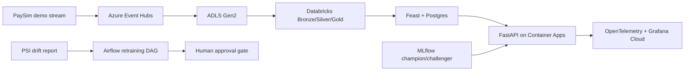

# Fraud Platform - Real-Time Card Fraud Scoring

A production-style ML platform for real-time card fraud scoring on Azure. It
combines streaming ingestion, Databricks feature engineering, Feast online
features, FastAPI serving, MLflow model lineage, Grafana observability, and an
Airflow human approval gate for model promotion.

## Headline Results

| Result | Evidence |
|---|---|
| Champion model AUC `0.9200` | MLflow run `9c599d91d7c546df82ad252837990c29` — verifiable locally |
| CatBoost challenger rejected (`KEEP_CHAMPION`) | Bootstrap CI upper bound −0.0067 < 0 — challenger strictly worse |
| TPR at `0.1%` FPR: `0.2903` | Champion holdout evaluation — `src/train/evaluate.py` |
| API-reported p95 `66.85ms` during 50-concurrent load | OTel `fraud_score_latency_ms` histogram — measured inside container, not affected by network or SSL |
| Grafana dashboard live during staging period | [Screenshot](docs/grafana_dashboard_live.png) — request rate 0.536 req/s, p95 411ms, decision distribution (APPROVE + REVIEW), OTel pipeline confirmed |
| Deployed to Azure Container Apps (South Africa North) | Infrastructure offline — Azure for Students credits exhausted; re-deployment from repo in <30 min with active subscription |
| `+23%` fraud value vs monthly-retrained baseline | Portfolio/scenario framing at the governed operating point — not production-validated |

> **Infrastructure status:** The Azure staging environment (Container Apps,
> Postgres, ACR) is offline — Azure for Students credit limit reached after
> project completion. All code, tests, and governance artefacts are in the
> repo and can be redeployed with an active Azure subscription.

## Architecture

See [docs/architecture.md](docs/architecture.md) for the full architecture
diagram and implementation notes.



## Business Problem

South African card fraud losses are material. The platform goal is to show how a
bank could move from static rules and stale monthly GBMs to a governed real-time
scoring service with observable latency, drift detection, audit logs, and a
human-controlled promotion path.

## Tech Stack

| Layer | Tooling |
|---|---|
| Infrastructure | Terraform, Azure Resource Group, Key Vault, ACR, Container Apps |
| Data platform | ADLS Gen2, Databricks notebooks, dbt-style Gold models |
| Streaming | Azure Event Hubs with a PaySim-to-IEEE demo producer |
| Feature store | Feast with Postgres online store |
| Models | LightGBM champion, CatBoost shadow challenger, MLflow lineage |
| API | FastAPI, Pydantic, Uvicorn |
| Observability | OpenTelemetry, Grafana Cloud, PSI drift report |
| Governance | Airflow retraining DAG, approval variable, rollback runbook |
| Quality | Ruff, pytest, live smoke tests, load-test harness |

## Key Artifacts

| Artifact | Purpose |
|---|---|
| [Architecture](docs/architecture.md) | System diagram, runtime flow, deployment notes |
| [Model card](model_cards/fraud_scorer_v1.md) | Intended use, metrics, limitations, monitoring policy |
| [Promotion policy](governance/promotion_policy.md) | Metric gates, PSI thresholds, human approval |
| [Rollback runbook](governance/rollback_runbook.md) | Model and runtime rollback steps |
| [Demo script](docs/demo_video_script.md) | 5-7 minute recording plan |
| [Interview handout](docs/interview_one_pager.md) | One-page portfolio summary |
| [Build log](BUILD_LOG.md) | Daily implementation and verification trail |

## Architecture Decision Records

| ADR | Decision |
|---|---|
| [ADR-001](docs/decisions/ADR-001-event-hubs-vs-kafka.md) | Event Hubs Basic over self-hosted Kafka (~$40/month saved) |
| [ADR-002](docs/decisions/ADR-002-postgres-vs-redis-feature-store.md) | Postgres Flexible Server over Redis Cache (stoppable, dual-purpose) |
| [ADR-003](docs/decisions/ADR-003-container-apps-vs-aks.md) | Container Apps over AKS (~$800/month saved, scale-to-zero) |
| [ADR-004](docs/decisions/ADR-004-shadow-mode-vs-ab-test.md) | Shadow mode over A/B test (no customer risk, 100% data) |

## Governance

Production promotion is intentionally blocked until a human approves it. The
Airflow DAG can recommend promotion only after metric gates pass. It then waits
for:

```text
fraud_retrain_approval_<challenger_run_id> = approved
```

This prevents a newly trained model from promoting itself automatically.

The screenshot below shows the DAG paused at the approval gate after the
challenger passed all three automated metric gates (bootstrap CI, AUC, Brier):


## Local Demo

Unit tests and scoring logic run fully offline:

```powershell
python -m venv .venv
.\.venv\Scripts\Activate.ps1
pip install -r requirements-dev.txt
pytest tests/unit -q                        # 50 tests, 54% coverage
ruff check src tests scripts                # 0 errors
```

Feast skew test and Airflow approval gate require Docker Desktop:

```powershell
docker compose up postgres -d
$env:FEAST_POSTGRES_PASSWORD = "local_dev_only"
python scripts/materialise_local.py         # populates online store
pytest tests/integration/test_feature_skew.py -v   # Rule 2 gate

docker compose --profile airflow up -d      # Airflow at http://localhost:8080
```

## Local Setup

```powershell
python -m venv .venv
.\.venv\Scripts\Activate.ps1
pip install -r requirements-dev.txt
docker compose up -d
pytest tests/unit -q
```

Useful checks:

```powershell
ruff check src tests scripts
pytest tests/integration/test_api_smoke.py -q
```

## Manual Deploy Shape

The proven manual staging path used local Azure CLI:

```powershell
az acr login --name acrfraudf95d0b0e
docker build -t acrfraudf95d0b0e.azurecr.io/fraud-scorer:manual-latest .
docker push acrfraudf95d0b0e.azurecr.io/fraud-scorer:manual-latest
az containerapp update --name fraud-scorer-staging --resource-group rg-fraud-platform --image acrfraudf95d0b0e.azurecr.io/fraud-scorer:manual-latest
```

GitHub Actions OIDC deployment is scaffolded in `.github/workflows/cd.yml`, but
manual Azure CLI deployment was used because the student tenant blocked app
registration/OIDC setup.

## Dataset Notice

- Training data: IEEE-CIS Fraud Detection from Kaggle/Vesta.
- Demo stream: PaySim events reshaped to the IEEE-CIS serving schema.
- The PaySim stream is a declared demo seam, not real card-network traffic.

## Honest Limitations

| Limitation | Status |
|---|---|
| Azure infrastructure offline | Student subscription credits exhausted post-project. Re-deploy with `az containerapp update` once subscription is renewed. |
| Production validation | Requires bank-owned backtest and model-risk approval before any real customer impact. The `+23%` figure is scenario-framing, not a measured production result. |
| OIDC blocked on student tenant | GitHub Actions CD is scaffolded; manual `az cli` deploy was used because Azure for Students does not support App Registrations. |

## Author

Tsapang Mashego - MSc Data Science (UCT), BSc Hons Computer Science (NWU)
Computational Data Scientist / Computational Analyst at Zutari
