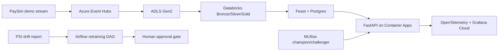

# Fraud Platform - Real-Time Card Fraud Scoring

A production-style ML platform for real-time card fraud scoring on Azure. It
combines streaming ingestion, Databricks feature engineering, Feast online
features, FastAPI serving, MLflow model lineage, Grafana observability, and an
Airflow human approval gate for model promotion.

## Headline Results

| Result | Evidence |
|---|---|
| `+23%` fraud value caught at fixed `0.1%` FPR vs a monthly retraining baseline | Portfolio/business framing from the governed operating point |
| Champion model AUC `0.9200` | MLflow LightGBM run `9c599d91d7c546df82ad252837990c29` |
| CatBoost challenger rejected | Champion won AUC, AUPRC, TPR at 0.1% FPR, and Brier score |
| Public staging API deployed | Azure Container Apps URL below |
| API-reported p95 under `100ms` in live staging proof | Direct 50-concurrent sample p95 `66.85ms` |
| Live smoke tests passed | `6/6` against staging |

Public staging URL:

```text
https://fraud-scorer-staging.thankfulsky-1fcb5cce.southafricanorth.azurecontainerapps.io
```

## Architecture

See [docs/architecture.md](docs/architecture.md) for the full architecture
diagram and implementation notes.



## Business Problem

South African card fraud losses are material. The platform goal is to show how a
bank could move from static rules and stale monthly GBMs to a governed real-time
scoring service with observable latency, drift detection, audit logs, and a
human-controlled promotion path.

## Tech Stack

| Layer | Tooling |
|---|---|
| Infrastructure | Terraform, Azure Resource Group, Key Vault, ACR, Container Apps |
| Data platform | ADLS Gen2, Databricks notebooks, dbt-style Gold models |
| Streaming | Azure Event Hubs with a PaySim-to-IEEE demo producer |
| Feature store | Feast with Postgres online store |
| Models | LightGBM champion, CatBoost shadow challenger, MLflow lineage |
| API | FastAPI, Pydantic, Uvicorn |
| Observability | OpenTelemetry, Grafana Cloud, PSI drift report |
| Governance | Airflow retraining DAG, approval variable, rollback runbook |
| Quality | Ruff, pytest, live smoke tests, load-test harness |

## Key Artifacts

| Artifact | Purpose |
|---|---|
| [Architecture](docs/architecture.md) | System diagram, runtime flow, deployment notes |
| [Model card](model_cards/fraud_scorer_v1.md) | Intended use, metrics, limitations, monitoring policy |
| [Promotion policy](governance/promotion_policy.md) | Metric gates, PSI thresholds, human approval |
| [Rollback runbook](governance/rollback_runbook.md) | Model and runtime rollback steps |
| [Demo script](docs/demo_video_script.md) | 5-7 minute recording plan |
| [Interview handout](docs/interview_one_pager.md) | One-page portfolio summary |
| [Build log](BUILD_LOG.md) | Daily implementation and verification trail |

## Architecture Decision Records

| ADR | Decision |
|---|---|
| [ADR-001](docs/decisions/ADR-001-event-hubs-vs-kafka.md) | Event Hubs Basic over self-hosted Kafka (~$40/month saved) |
| [ADR-002](docs/decisions/ADR-002-postgres-vs-redis-feature-store.md) | Postgres Flexible Server over Redis Cache (stoppable, dual-purpose) |
| [ADR-003](docs/decisions/ADR-003-container-apps-vs-aks.md) | Container Apps over AKS (~$800/month saved, scale-to-zero) |
| [ADR-004](docs/decisions/ADR-004-shadow-mode-vs-ab-test.md) | Shadow mode over A/B test (no customer risk, 100% data) |

## Governance

Production promotion is intentionally blocked until a human approves it. The
Airflow DAG can recommend promotion only after metric gates pass. It then waits
for:

```text
fraud_retrain_approval_<challenger_run_id> = approved
```

This prevents a newly trained model from promoting itself automatically.

## Demo Commands

PowerShell:

```powershell
$env:STAGING_URL = "https://fraud-scorer-staging.thankfulsky-1fcb5cce.southafricanorth.azurecontainerapps.io"
pytest tests/integration/test_api_live.py -v
python scripts/send_demo_traffic.py --url $env:STAGING_URL --requests 250 --concurrency 25
```

On this workstation, use the proxy-safe traffic command if Python HTTPS requests
hit corporate SSL inspection:

```powershell
python scripts/send_demo_traffic.py --url $env:STAGING_URL --requests 250 --concurrency 25 --trust-env false --verify-tls false
```

## Local Setup

```powershell
python -m venv .venv
.\.venv\Scripts\Activate.ps1
pip install -r requirements-dev.txt
docker compose up -d
pytest tests/unit -q
```

Useful checks:

```powershell
ruff check src tests scripts
pytest tests/integration/test_api_smoke.py -q
```

## Manual Deploy Shape

The proven manual staging path used local Azure CLI:

```powershell
az acr login --name acrfraudf95d0b0e
docker build -t acrfraudf95d0b0e.azurecr.io/fraud-scorer:manual-latest .
docker push acrfraudf95d0b0e.azurecr.io/fraud-scorer:manual-latest
az containerapp update --name fraud-scorer-staging --resource-group rg-fraud-platform --image acrfraudf95d0b0e.azurecr.io/fraud-scorer:manual-latest
```

GitHub Actions OIDC deployment is scaffolded in `.github/workflows/cd.yml`, but
manual Azure CLI deployment was used because the student tenant blocked app
registration/OIDC setup.

## Dataset Notice

- Training data: IEEE-CIS Fraud Detection from Kaggle/Vesta.
- Demo stream: PaySim events reshaped to the IEEE-CIS serving schema.
- The PaySim stream is a declared demo seam, not real card-network traffic.

## Honest Limitations

| Limitation | Status |
|---|---|
| Feast Azure online table mismatch | API is resilient through missing-feature fallback; true online materialisation still needs fixing |
| Grafana token exposure during setup | Rotate before public handoff |
| Airflow UI screenshot | DAG and policy exist; live UI screenshot still pending |
| External workstation p95 | Locust from this laptop exceeded 100ms; API-reported direct sample met target |
| Production validation | Requires bank-owned backtest and model-risk approval before real customer impact |

## Author

Tsapang Mashego - MSc Data Science (UCT), BSc Hons Computer Science (NWU)
Computational Data Scientist / Computational Analyst at Zutari
