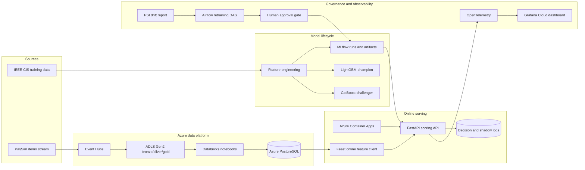
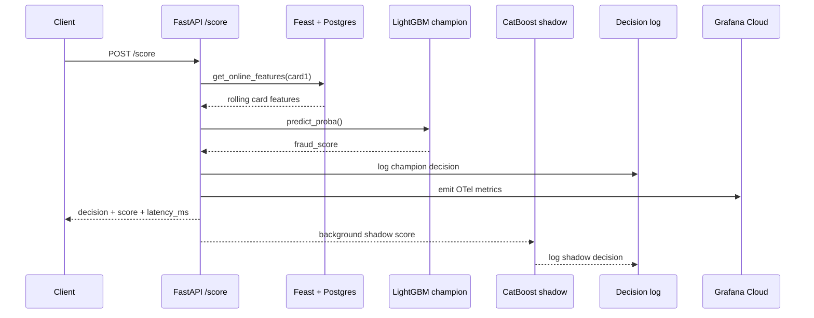
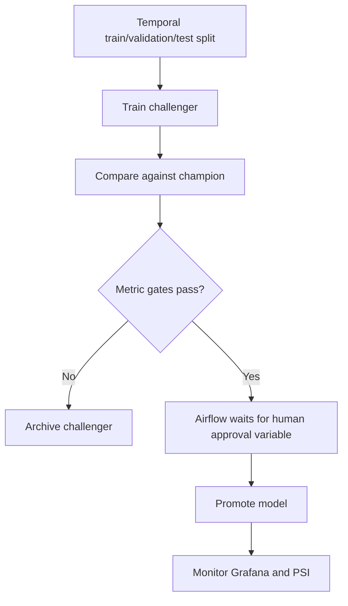

# Fraud Platform Architecture

This document describes the deployed portfolio architecture for the real-time
fraud scoring platform. It separates what is live today from the intentionally
documented demo seams.

## System View

## Runtime Scoring Flow

1. A transaction is submitted to `POST /score`.
2. FastAPI validates the payload with Pydantic.
3. The service fetches card-level rolling features from Feast/Postgres.
4. The LightGBM champion returns a fraud probability.
5. Business thresholds map the score to `APPROVE`, `REVIEW`, or `DECLINE`.
6. The champion decision is logged.
7. The CatBoost challenger scores in the background only and writes a shadow
   record. It never affects the live response.
8. OpenTelemetry emits request, latency, decision, and fraud-score metrics to
   Grafana Cloud.

## Training and Promotion Flow

Promotion requires two layers of control:

| Layer | Purpose |
|---|---|
| Automated metric gate | Challenger must beat the champion on governed metrics. |
| Human approval gate | Airflow waits for `fraud_retrain_approval_<run_id> = approved`. |

The current champion remains LightGBM because it beat the CatBoost challenger on
AUC, AUPRC, TPR at 0.1% FPR, and Brier score.

## Deployed Azure Resources

| Component | Resource |
|---|---|
| Resource group | `rg-fraud-platform` |
| Container registry | `acrfraudf95d0b0e` |
| Container Apps environment | `cae-fraud-f95d0b0e` |
| Staging scoring app | `fraud-scorer-staging` |
| Public staging URL | `https://fraud-scorer-staging.thankfulsky-1fcb5cce.southafricanorth.azurecontainerapps.io` |
| Key Vault | `kv-fraud-f95d0b0e` |
| Postgres server | `psql-fraud-f95d0b0e.postgres.database.azure.com` |
| Grafana stack | `tshepangamir.grafana.net` |

## Observability

Grafana Cloud receives OpenTelemetry metrics from the scoring service:

| Panel | Metric source |
|---|---|
| Request rate | `fraud_decisions_total` |
| p95 / p99 scoring latency | `fraud_score_latency_ms_bucket` |
| 5xx error rate | HTTP server duration status labels |
| Decision distribution | `fraud_decisions_total{decision=...}` |
| Fraud score distribution | `fraud_score_bucket` |
| Drift status | `reports/psi_scores.json` generated by Evidently/PSI code |

The app has live proof for `/health`, `/ready`, `/score`, live smoke tests, and
Grafana metrics. The strict external workstation p95 target is still a known
follow-up; API-reported scoring latency met the target in the direct concurrency
sample.

## Security and Secrets

Secrets are not stored in code. Runtime values come from Azure Key Vault or
Container Apps secret references:

| Secret | Used for |
|---|---|
| `postgres-password` | Feast online store and decision log database access |
| `grafana-otlp-token` | OpenTelemetry export to Grafana Cloud |
| Event Hubs connection string | Demo stream producer |
| Databricks PAT | Notebook and secret-scope setup only |

The Grafana token was exposed during manual setup and must be rotated before the
final public handoff.

## Known Demo Seams

| Seam | Explanation |
|---|---|
| PaySim stream | Used to simulate live transactions and exercise the platform path. |
| Feast live fallback | The deployed API falls back to numeric missing feature defaults when the expected Azure Postgres Feast table is missing. |
| Airflow UI screenshot | DAG and policy are implemented locally; a live Airflow screenshot is still pending. |
| External p95 latency | Workstation-to-Azure Locust p95 exceeded 100ms; API-reported latency met the direct scoring target. |

These are documented deliberately so the project stays honest and defensible in
an interview.
